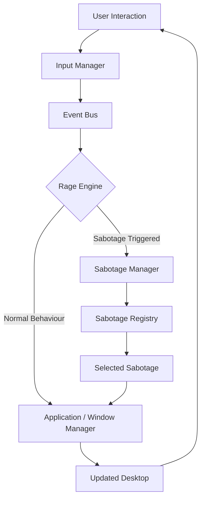
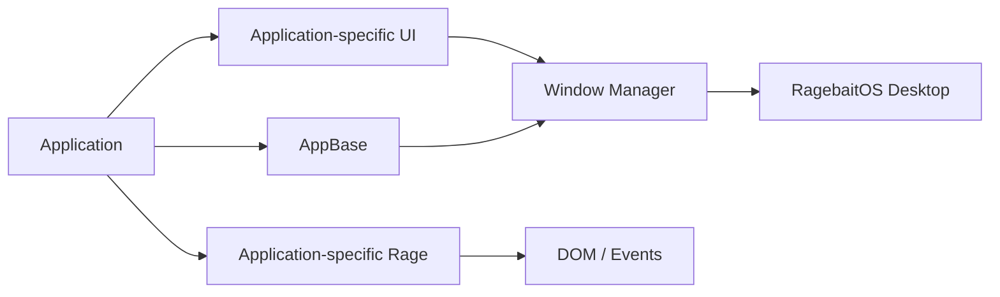

# RagebaitOS 🎯

## Basic Details

### Team Name: Nova Supreme

### Team Members

* Team Lead: Achind Babu - MEC
* Member 2: Anvay Patrick Savio Dsouza - MEC

## Project Description

### The Problem (that doesn't exist)

Have you ever used a computer and thought:

> "Wow, this is working way too well."

Neither have we.

Modern operating systems are designed to make computers easier, faster, and more convenient to use. This creates a serious problem: **the user is not suffering enough.**

RagebaitOS solves this completely unnecessary problem by creating a fake desktop operating system where everyday computer interactions can randomly betray the user.

Want to open the Weather app?

Maybe Calculator opens.

Trying to type something?

Maybe your keyboard decides that letters should become numbers.

Trying to maximize a window?

Congratulations. You minimized it.

Moving your mouse?

The cursor has other plans.

The problem was never productivity.

**The problem was insufficient rage.**

---

### The Solution (that nobody asked for)

**RagebaitOS** is a browser-based fake operating system designed specifically to frustrate, confuse, and ragebait its users.

It provides a familiar desktop-like interface containing applications, windows, a taskbar, and normal computer interactions.

However, underneath the interface is a **Rage Engine** that occasionally sabotages the user's actions.

The system combines normal functionality with unpredictable behavior so that users initially believe they are using a normal operating system.

As they continue interacting, the OS begins betraying them.

Some examples include:

* Opening one application may launch another application.
* Keyboard input may randomly become corrupted.
* Words may mysteriously reverse when pressing Space or Enter.
* Maximizing a window may minimize it instead.
* The visual cursor can drift away from where the user expects it to be.
* Cursor movement can become distorted.
* Buttons can run away when the user tries to click them.
* Individual applications can contain their own unique sabotage mechanics.

The goal is not simply to make a broken website.

The goal is to create a **believable operating system that is intentionally broken in entertaining ways.**

---

## Technical Details

### Technologies/Components Used

### For Software

**Languages used:**

* JavaScript
* HTML
* CSS

**Frameworks used:**

* Vite

**Libraries used:**

* No external UI framework
* Native browser APIs
* JavaScript ES Modules

**Tools used:**

* Visual Studio Code
* Git
* GitHub
* Vite Development Server
* Web Browser
* GitHub Branches for parallel development

---

### For Hardware

RagebaitOS is a software-only project and does not require dedicated hardware components.

**Main components:**

* Any computer capable of running a modern web browser
* Keyboard
* Mouse / Trackpad

**Recommended specifications:**

* Modern Windows/Linux/macOS system
* 4 GB RAM or more
* Modern Chromium/Firefox/Safari-based browser
* Internet connection for development dependencies

**Tools required:**

* Node.js
* npm
* Git
* Visual Studio Code
* Modern web browser

---

# Implementation

## For Software

RagebaitOS is implemented as a modular browser-based desktop environment.

The project is divided into several major systems:

### Desktop System

Provides the visual desktop environment and taskbar.

The taskbar dynamically interacts with the registered applications and running windows.

### Application Manager

The `AppManager` handles:

* Application registration
* Application launching
* Running application tracking
* Application closing
* Communication with the Window Manager

### Window Manager

The `WindowManager` provides the common desktop window functionality.

It handles:

* Window creation
* Window closing
* Window focusing
* Window dragging
* Window minimizing
* Window restoring
* Window maximizing

This allows applications to focus on their own functionality instead of implementing their own window systems.

### Event Bus

The EventBus allows different systems to communicate without being tightly coupled.

Examples of events include:

* `APP_OPEN_REQUEST`
* `APP_OPEN_APPROVED`
* `APP_OPENED`
* `APP_CLOSED`
* `WINDOW_CLOSED`
* `UI_CLICK`
* `POINTER_MOVE`
* `KEYBOARD_INPUT`
* `RAGE_TRIGGERED`

### Rage Engine

The Rage Engine is the central sabotage system.

It listens for user interactions and determines whether a sabotage should occur.

This allows normal functionality and rage functionality to coexist.

### Rage State

RagebaitOS maintains a rage state that tracks:

* Current rage level
* Number of rage-triggering events

The rage system can be expanded in the future to allow increasingly severe sabotage as the user's rage increases.

### Sabotage Manager

The Sabotage Manager provides a centralized mechanism for registering and triggering sabotage modules.

This keeps individual sabotage mechanics modular and makes it easier to add new forms of chaos.

---

# Installation

Clone the repository:

```bash
git clone https://github.com/AchindBabuCS/Useless-Projects-3.0-Team-Nova-Supreme-.git
```

Navigate into the project:

```bash
cd Useless-Projects-3.0-Team-Nova-Supreme-
```

Install dependencies:

```bash
npm install
```

---

# Run

Start the Vite development server:

```bash
npm run dev
```

Open the local development URL shown in the terminal, usually:

```text
http://localhost:5173
```

The RagebaitOS desktop will then load in the browser.

---

# Project Documentation

## Software

### Project Architecture

RagebaitOS follows a modular architecture where the operating system foundation is separated from individual applications and sabotage mechanics.

```text
RagebaitOS
│
├── Desktop
│   ├── Desktop Manager
│   └── Taskbar
│
├── Core
│   ├── Event Bus
│   ├── Application Manager
│   ├── Window Manager
│   └── Input Manager
│
├── Rage System
│   ├── Rage Engine
│   ├── Rage State
│   ├── Sabotage Manager
│   ├── Sabotage Registry
│   └── Sabotages
│
└── Applications
    ├── AppBase
    ├── Calculator
    ├── Browser
    ├── Weather
    ├── File Manager
    └── Other Applications
```

---

# Screenshots

> Screenshots will be added after the final UI and applications are completed.

### Screenshot 1


**Caption:** RagebaitOS desktop environment showing the taskbar and application interface.

### Screenshot 2


**Caption:** An application running inside the RagebaitOS window management system.

### Screenshot 3


**Caption:** An example of RagebaitOS intentionally sabotaging a normal user interaction.

---

# Diagrams

## Workflow / System Architecture



**Caption:** RagebaitOS processes user interactions through the Input Manager and Event Bus. The Rage Engine decides whether the interaction should behave normally or trigger a sabotage before the resulting action is reflected on the desktop.

---

## Application Architecture



**Caption:** Each application follows a modular structure based on AppBase while using the existing Window Manager. Application-specific rage mechanics remain isolated inside the application's own folder.

---

# Global Sabotage Mechanics

RagebaitOS currently includes several reusable sabotage mechanisms.

### Application Redirect

The user attempts to open one application, but RagebaitOS may open another application instead.

```text
User
 ↓
Open Weather
 ↓
Rage Engine
 ↓
App Redirect
 ↓
Calculator opens
```

---

### Keyboard Corruption

Text entered by the user may occasionally be transformed into unexpected numbers or symbols.

This makes normal typing increasingly unreliable.

---

### Word Reversal

Pressing Space or Enter may occasionally reverse the current word.

Example:

```text
hello
```

may become:

```text
olleh
```

---

### Expand → Minimize

The maximize action can occasionally betray the user by minimizing the window instead.

---

### Click Drift

Clicking can cause the visual cursor to drift away from its expected position.

---

### Cursor Distortion

The visual cursor can be displaced from the user's actual pointer position, creating the illusion that the mouse is malfunctioning.

---

### Runaway Buttons

Certain buttons can move away from the cursor when the user tries to interact with them.

This makes simple interactions unnecessarily difficult.

---

# Modular Application System

Applications are designed to be independently developed.

Each application has its own directory:

```text
src/apps/
│
├── base/
│   └── appBase.js
│
├── calculator/
│   ├── calculator.js
│   └── calculator.css
│
├── browser/
│   ├── browser.js
│   └── browser.css
│
├── weather/
│   ├── weather.js
│   └── weather.css
│
└── ...
```

Each application:

* Extends `AppBase`
* Has a unique application ID
* Has its own UI
* Has its own CSS
* Can have application-specific sabotage mechanics
* Uses the existing Window Manager
* Avoids modifying the global Rage Engine unnecessarily

This architecture allows multiple team members to develop applications independently with minimal Git conflicts.

---

# Branching Strategy

The project uses feature branches for independent application development.

```text
anvay
│
├── feature/calculator
├── feature/browser
├── feature/weather
├── feature/file-manager
└── feature/settings
```

The core RagebaitOS foundation is kept stable while individual applications are developed separately.

This allows multiple developers to work simultaneously without constantly modifying the same files.

---

# Design Philosophy

RagebaitOS follows three main principles:

### 1. Looks Normal

The interface should initially resemble a normal desktop operating system.

### 2. Works Normally

Basic application functionality should generally work so that users trust the system.

### 3. Betrays the User

At unpredictable moments, RagebaitOS introduces sabotage.

The ideal experience is:

```text
Looks normal
     ↓
Works normally
     ↓
Something weird happens
     ↓
User ignores it
     ↓
Another weird thing happens
     ↓
User gets confused
     ↓
The OS gets worse
     ↓
User gets angry
     ↓
😂
```

---

# Hardware

RagebaitOS does not require custom hardware, electronic components, sensors, or external circuits.

The project is entirely browser-based and can run on a standard computer.

---

# Schematic & Circuit

Not applicable.

RagebaitOS is a software-only project and does not contain an electronic circuit or hardware schematic.

---

# Build Photos

Not applicable.

No physical hardware is required for RagebaitOS.

---

# Project Demo

## Video


https://github.com/user-attachments/assets/6d450222-e0c4-4182-9650-e658b544f86d


---

# Additional Demos

Additional demonstration materials may include:

* Short clips of individual sabotage mechanics
* GIFs demonstrating application-specific rage mechanics
* Screenshots of unusual OS behaviour
* GitHub project repository
* Architecture documentation

---

# Team Contributions

* Achind Babu: Fullstack Development
* Anvay Patrick Savio Dsouza: Fullstack Development

---

# Future Improvements

Potential future improvements include:

* More applications
* More application-specific sabotage mechanics
* Rage-based difficulty scaling
* More advanced window glitches
* Fake system notifications
* Fake error messages
* Fake system updates
* Fake crashes
* Fake antivirus warnings
* Desktop icon chaos
* More elaborate cursor behaviour
* Random UI transformations
* Sound effects for sabotage events
* A final "maximum rage" mode
* More polished animations and visual effects

---

# Why RagebaitOS?

Most software tries to eliminate frustration.

**RagebaitOS is built to manufacture it.**

It takes the familiar experience of using a desktop operating system and deliberately introduces unpredictable, harmless, and entertaining failures.

The result is a completely unnecessary operating system for a completely unnecessary problem:

## The user is not angry enough.

---

Made with ❤️ at TinkerHub Useless Projects


